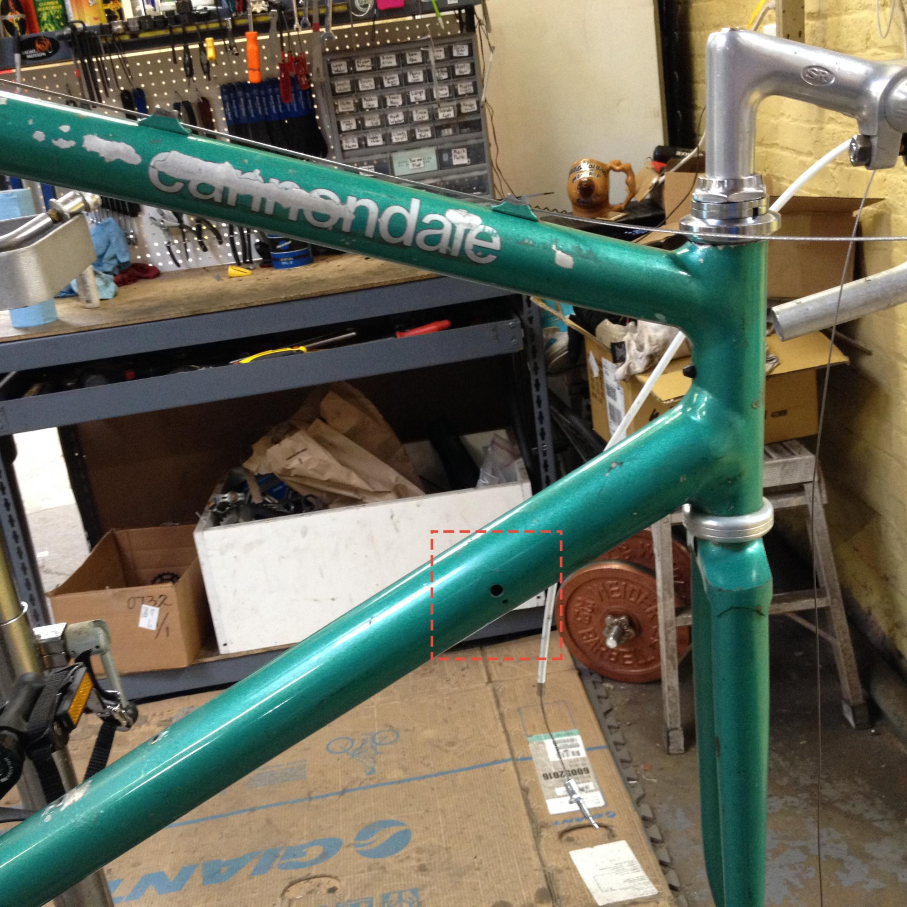
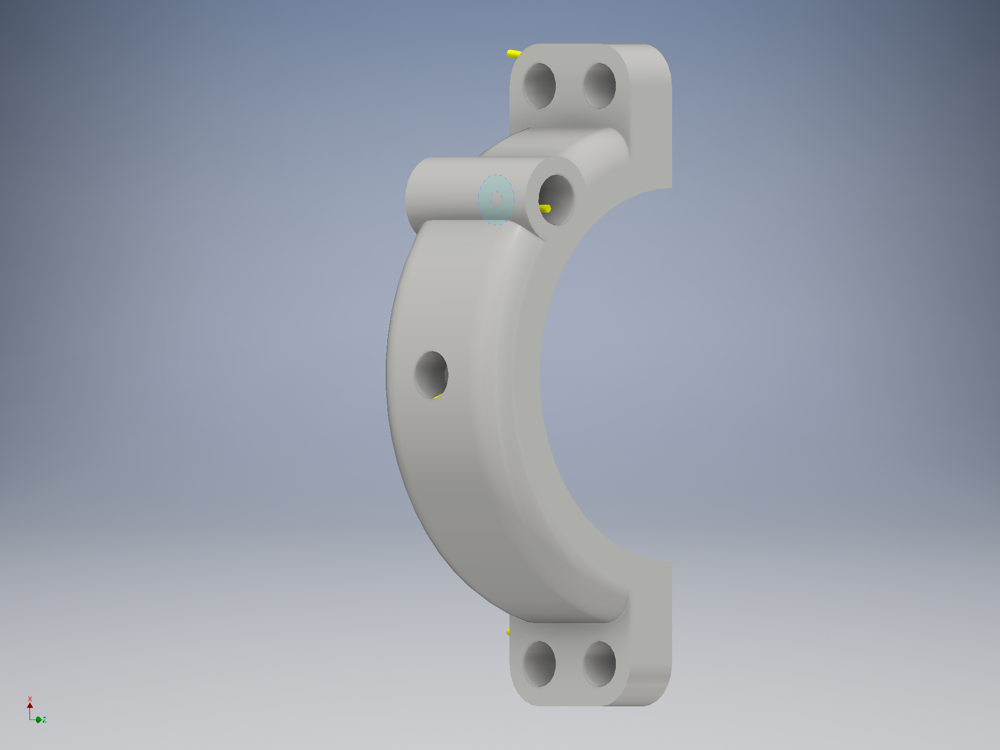
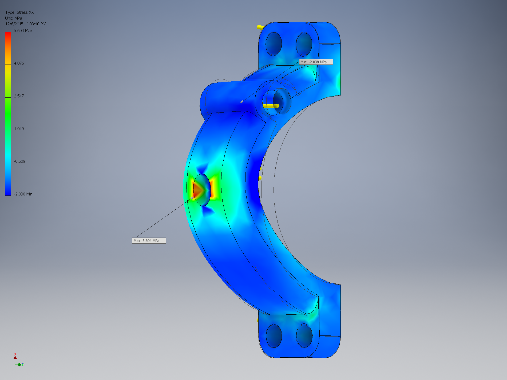
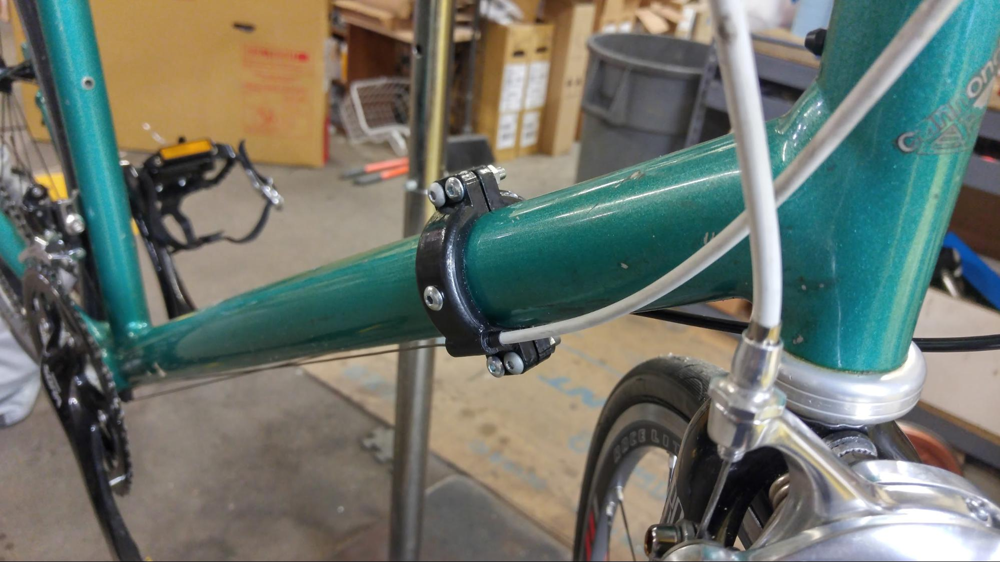

This is a post I wrote up for my company Ekta Flow about how I used 3D printing to breathe life into an old bicycle frame. The old bicycle frame used an out of manufacturing part for shifting and with the nonstandard tube size, a suitable replacement was incredibly hard to come by. But with a little ingenuity and experimentation - a 3D printed cable stop was invented to save the day!

><html><head><meta content="text/html; charset=UTF-8" http-equiv="content-type"></head><body class="c8">

People say variety is the spice of life. 

But spice, the literal spice of life, has always lead me to overheating and sweating. Oddly enough, that also happens to be how I describe the experience of trying to spice up my life. 

This is the story of my experience as a bicycle mechanic. 

I was just about to be 19 when I finished up my first year in college. The first year was all about &nbsp;general education courses - so I didn&rsquo;t really have any practical knowledge in anything. I had been applying exclusively to engineering companies before I noticed an ad by chance on craigslist - a posting for a bicycle builder at Kozy&rsquo;s Cyclery in Chicago. 

The posting called for experience in bicycle repair and build. I had no experience in either of those things &nbsp;- so obviously, I applied! It would be a different experience and definitely wasn&rsquo;t be an expected experience I&rsquo;d have in my life. But I&rsquo;ve always loved riding my bicycles so I figured, some variety would be welcomed!

&nbsp;With some help from google clip art of gears &amp; microsoft paint to dazzle my cover letter &amp; resume - I managed to get an interview. A portion of that very same cover letter is shown down below!

A week afterwards, I had a workbench and was building bikes in the shop area of Kozy&rsquo;s cyclery on South Wabash. I was taught how to build and eventually fix bicycles by the friendly senior mechanics in the store. Summer flew by quickly, I would go home hot, exhausted and sweating everyday but I loved it. 

Even after schooling started, I to tinker and mess with bikes. I decided that I wanted to resurrect a <a class="c0" href="https://www.google.com/url?q=http://www.vintagecannondale.com/year/1985/1985.pdf&amp;sa=D&amp;ust=1578998735576000">1985 SR500 Cannondale</a>. It was a premium frame for it&rsquo;s time, but it was missing an out-of-production part. The part in question was a Suntour cyclone shifter which also acted as a cable stop, crucial for accurate gear changing. I spent weeks searching for the shifter and alternatives, even with Cannondale support telling me that the best chance was finding that Suntour shifter. Without that shifter, I was stuck without a way to get the shifting working and hopelessly out of luck in getting this frame to ride again.

The missing part to complete the bike resurrection.

Or was I?

Since I updated all the old parts to use modern Shimano 105 components, the shifting mechanism was integrated with the brakes via Shimano&rsquo;s STi. So all I really needed to do was to have a cable stop, which is when I remembered something about my university orientation. We had 3D printers free for use for students! And best of all? I already had the knowledge to make what I needed.

I fired up my student version of AutoCad Inventor and went to work. I even studied basic structural analysis in Inventor to analyze the part&rsquo;s structural integrity to make sure the final product was stiff enough to not affect shifting accuracy.

A side by side of the part I designed and the analysis results I completed on it.

&nbsp;A week later, I had a working prototype.

&nbsp;Two weeks later, I completed enough iterations of trial and error with the 3D printer that I had a finished product. 

The 3D printed cable stop with a layer of epoxy coating.

By the third week, I was biking down Chicago&rsquo;s lakeshore drive with accurate shifting with the Shimano 105 groupset and custom made cable stop. It remains my favorite bike and the cable stop is still holding strong 5 years later.

That experience of seeing the bike come back to life by my own hands brought me a joy I&rsquo;d never experienced until then. But I never would&rsquo;ve had that joy if I hadn&rsquo;t gone off the beaten path by applying to be a bicycle builder. By next summer, while my peers were looking at internships at engineering companies such as Boeing or Northrop Grumman, I was looking forward to another summer back in the shop with the hilarious senior mechanics. 

&nbsp;&nbsp;&nbsp;&nbsp;&nbsp;&nbsp;&nbsp;&nbsp;I still think back that applying to the craigslist job posting as the genesis of the tinkerer inside me. Although the experience was alike to tasting spice for me, it also awoke a love towards creating and fixing things. And that has shaped my life and career choices ever since - all thanks to a little spice of life, variety.
</body></html>
